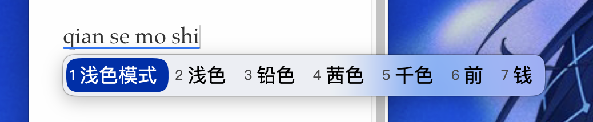
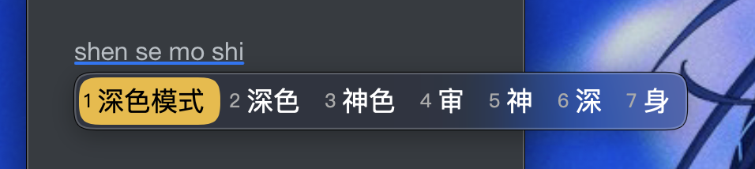

# rime-macos-frosted
# macOS Frosted Squirrel Theme

一个为 macOS 鼠须管（Squirrel）设计的磨砂透明皮肤，支持系统深浅色模式自动切换。

### 预览

### 安装方法

1. 下载仓库中的 `squirrel.yaml`。
2. 放入鼠须管用户配置目录：`~/Library/Rime/`。
3. **注意**：这会覆盖你原本的全局样式配置。
4. 点击状态栏图标选择「重新部署」。

### 推荐字体

* 默认使用 `PingFangSC-Regular`，如需更改请自行修改文件中的 `font_face`。
